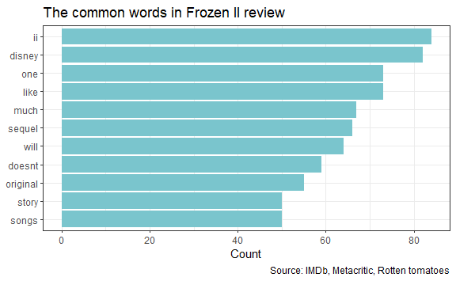
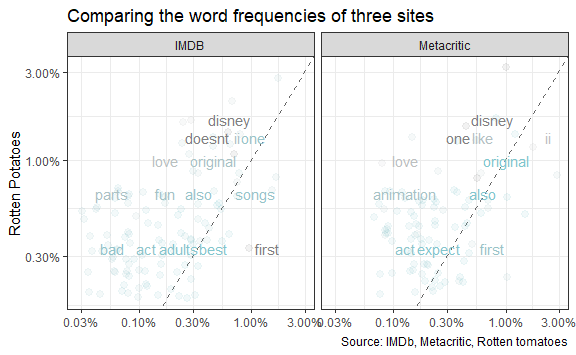

Frozen2 review sentiment analysis
================
Kejing Li
11/26/2019

<table>

<caption>

Frozen II Review Word Count

</caption>

<thead>

<tr>

<th style="text-align:center;">

Word

</th>

<th style="text-align:center;">

Number

</th>

</tr>

</thead>

<tbody>

<tr>

<td style="text-align:center;">

film

</td>

<td style="text-align:center;">

113

</td>

</tr>

<tr>

<td style="text-align:center;">

ii

</td>

<td style="text-align:center;">

84

</td>

</tr>

<tr>

<td style="text-align:center;">

disney

</td>

<td style="text-align:center;">

82

</td>

</tr>

<tr>

<td style="text-align:center;">

movie

</td>

<td style="text-align:center;">

78

</td>

</tr>

<tr>

<td style="text-align:center;">

like

</td>

<td style="text-align:center;">

73

</td>

</tr>

<tr>

<td style="text-align:center;">

one

</td>

<td style="text-align:center;">

73

</td>

</tr>

<tr>

<td style="text-align:center;">

much

</td>

<td style="text-align:center;">

67

</td>

</tr>

<tr>

<td style="text-align:center;">

sequel

</td>

<td style="text-align:center;">

66

</td>

</tr>

<tr>

<td style="text-align:center;">

will

</td>

<td style="text-align:center;">

64

</td>

</tr>

<tr>

<td style="text-align:center;">

doesnt

</td>

<td style="text-align:center;">

59

</td>

</tr>

</tbody>

<tfoot>

<tr>

<td style="padding: 0; border:0;" colspan="100%">

a Source: IMDb, Metacritic, Rotten tomatoes

</td>

</tr>

</tfoot>

</table>

