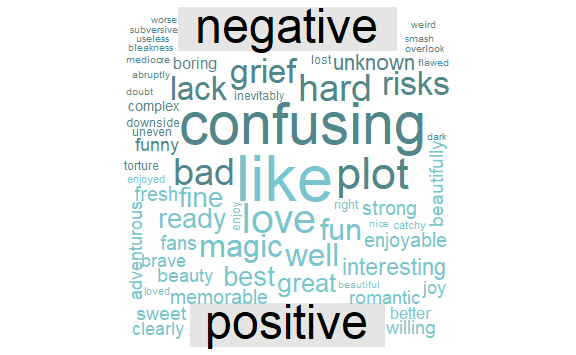

Frozen2 Review - Sentiment Analysis
================
Kejing Li
11/26/2019

  - [Introduction](#introduction)
  - [Text Analysis](#text-analysis)
      - [Word Frequency](#word-frequency)
          - [All websites](#all-websites)
          - [Across websites](#across-websites)
      - [Sentiment Analysis](#sentiment-analysis)
          - [Binary sentiments](#binary-sentiments)
          - [Catigorical sentiments](#catigorical-sentiments)
          - [Emotional Score](#emotional-score)
          - [Word Clouds](#word-clouds)
  - [Conclusion](#conclusion)

# Introduction

In this report, I will conduct text analysis, especially sentiment
analysis on the reviews of the movie Frozen II. The review data were
obtained by scraping([see code here](scrape.R)) three major English
review websites:Rotten Tomatoes, IMDb(Internet MovieDatabase) and
Metacritic.

I am interested in seeing the overall comment on the film as well as the
differences across each movie review websites. Though the three websites
all serve as movie review platforms and have certain extent of
popularity, the critics of each website can be quite different: Rotten
Tomatoes largely rely on the opinions of professional critics, IMDB uses
a system of ratings from the general public, Metacritic only open to
mainstream media such as *The Guardianand*、*New York Times* and other
professional film critics.

# Text Analysis

## Word Frequency

### All websites

I counted the frequency of each word in the dataset and the results are
as follows. The word “ii” appears most frequently in the movie reviews.
Combined with other words of high frequency like “one” and “sequel”, it
is quite evident that the people judge the movie heavily rely on the
fact that it is a sequel movie. There may be a tendency Frozen II is
appraised good or bad against Frozen I. Besides, “Disney” also appears
in the reviews quite often, indicating the significant brand effect of
Frozen II.

<table>

<caption>

Frozen II Review Word Count

</caption>

<thead>

<tr>

<th style="text-align:center;">

Word

</th>

<th style="text-align:center;">

Number

</th>

</tr>

</thead>

<tbody>

<tr>

<td style="text-align:center;">

ii

</td>

<td style="text-align:center;">

84

</td>

</tr>

<tr>

<td style="text-align:center;">

disney

</td>

<td style="text-align:center;">

82

</td>

</tr>

<tr>

<td style="text-align:center;">

like

</td>

<td style="text-align:center;">

73

</td>

</tr>

<tr>

<td style="text-align:center;">

one

</td>

<td style="text-align:center;">

73

</td>

</tr>

<tr>

<td style="text-align:center;">

much

</td>

<td style="text-align:center;">

67

</td>

</tr>

<tr>

<td style="text-align:center;">

sequel

</td>

<td style="text-align:center;">

66

</td>

</tr>

<tr>

<td style="text-align:center;">

will

</td>

<td style="text-align:center;">

64

</td>

</tr>

<tr>

<td style="text-align:center;">

doesnt

</td>

<td style="text-align:center;">

59

</td>

</tr>

<tr>

<td style="text-align:center;">

original

</td>

<td style="text-align:center;">

55

</td>

</tr>

<tr>

<td style="text-align:center;">

songs

</td>

<td style="text-align:center;">

50

</td>

</tr>

</tbody>

<tfoot>

<tr>

<td style="padding: 0; border:0;" colspan="100%">

a Source: IMDb, Metacritic, Rotten tomatoes

</td>

</tr>

</tfoot>

</table>

### Across websites

Next, I compared the word frequencies across the three different
websites, as shown in the figure below.

Words that are close to the line in these plots have similar frequencies
in both sets of texts, for example, in both Rotten Tomatoes and
Metacritic reviews (“original”, “movie” at the middle). Words that are
far from the line are words that are found more in one set of texts than
another. For example, in the Rotten Tomato-IMDB panel, words like “bad”,
“love” and “fun” are found in Rotten Tomatoes reviews but not much in
the IMDB, while words like “first” are found in the IMDB texts but not
the Rotten Tomatoes. In comparing Rotten Tomatoes with Metacritic,
Rotten Tomatoes reviewers use words like “love” and “animation” that
Metacritic critics does not.

Overall, notice in the following figure that the words extend to lower
frequencies in the Rotten Tomatoes-IMDB panel than in the Rotten
Tomatoes-Metacritic panel; there is empty space in the Rotten
Tomatoes-IMDB panel at low frequency. These characteristics indicate
that Rotten Tomatoes and the IMDB critics use more similar words than
Rotten Tomatoes and Metacritic. Also, we see that not all the words are
found in all three websites of reviews and there are fewer data points
in the panel for Rotten Tomatoes and Metacritic.

## Sentiment Analysis

### Binary sentiments

By conducting a binary sentiment analysis, we can see from the table
that the positive words outnumber the negative ones. Generally speaking,
reviewers tend to give positive comments on the movie.

<table>

<caption>

Binary sentiment of Frozen II Review

</caption>

<thead>

<tr>

<th style="text-align:center;">

Sentiment

</th>

<th style="text-align:center;">

Number

</th>

</tr>

</thead>

<tbody>

<tr>

<td style="text-align:center;">

negative

</td>

<td style="text-align:center;">

111

</td>

</tr>

<tr>

<td style="text-align:center;">

positive

</td>

<td style="text-align:center;">

160

</td>

</tr>

</tbody>

<tfoot>

<tr>

<td style="padding: 0; border:0;" colspan="100%">

a Source: IMDb, Metacritic, Rotten tomatoes

</td>

</tr>

</tfoot>

</table>

### Catigorical sentiments

The above graph depicts the top 10 words contributing to each sentiment
seperately. The categorical word counts reveal that **anticipation**,
**joy** and **positive** are dominant sentiments of the Frozen II, this
finding is consistent with the binary sentiment analysis, which jointly
explain that the film has a deightful and positive theme. In contrast,
negative sentiments such as anger, disgust, fear and sadness have
relatively low counts.

### Emotional Score

So far, we have concluded that the film has a postive theme, however,
the positivity could vary across websites. By assigning different values
to words using AFINN sentiment dictionary, we are able to quantify this
difference as fllows. The Rotten Tomatoes score highest amongst three,
suggesting its reviews are mostly positive. While the Metacritic has a
lower score, though still positive. The reviews on Metacritic may not
show as strong positive emotions as on the Rotten Tomatoes. IMDB is
somewhere in the middle.

### Word Clouds

Finally, to get a more intuitive results, let’s take a look at the
comparison of the negative and positive words in the wordclouds. On the
negative side, *grief*, *risks* and *hard* may reflect the plots of
Frozen II. On the other hand, it is reasonabe to conjecture words like
*bad*, *confusing* and *boring* are come from the negative reviews of
the film. Similarly, *love*, *magic* and *beauty* are more likely
derived from the theme Frozen II intending to get across. Words like
*enjoyable*, *like* and *nice* reflect the critics’ appreciation of the
movies.

# Conclusion

In a nutshell, Frozen II receives positive comments from the audiences,
both professionals and general publics. Still, discrepancy bewteen
different websites can still be detected. Specifically, Metacritic is
the most strict with the movie; critics from Rotten Tomatoes and IMDB
share more similar attitudes. Ultimately, the movie succeeds in
communicating a lively, delightful and hopeful mood.
